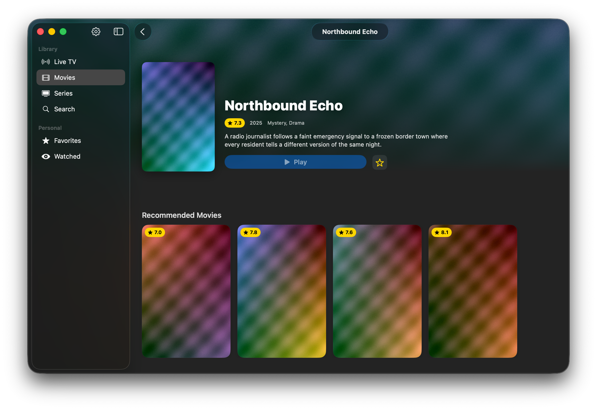
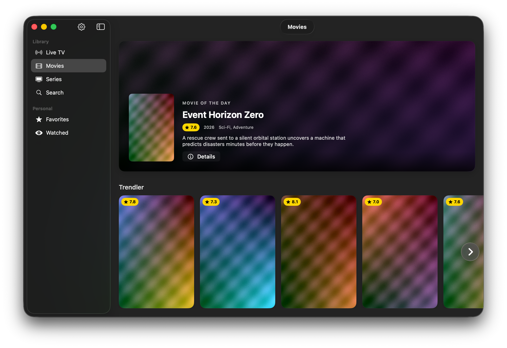

# tuplutv (beta)

**A simple, fast, and modern IPTV experience for macOS.**

---

## Screenshots
⚠️The films shown in the images were created using AI and serve as examples.

  
  

---

- ⚠️macOS 26 tahoe minimum system requirements

---
## Features

- Load and manage IPTV playlists
- Smooth video playback experience
- Clean and focused macOS interface
- Content browsing and media detail screens
- Modern SwiftUI architecture optimized for native performance

---
⚠️
The app does not provide any movie or TV content.
As the developer, I cannot and will not provide content sources.
You need to add your own Xtream or M3U sources.

---
## Legal Notes

### TMDB

This product uses the TMDB API but is not endorsed or certified by TMDB.

### VLC / VLCKit

This app may use VLCKit/VLC components for video playback. VLC is a product of the VideoLAN project.

- VLC: [https://www.videolan.org/vlc/](https://www.videolan.org/vlc/)
- VideoLAN: [https://www.videolan.org/](https://www.videolan.org/)

Usage is subject to the license terms of the related libraries.
