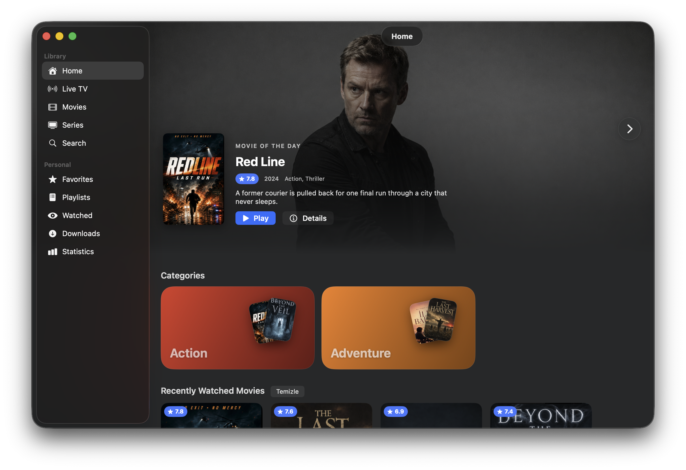
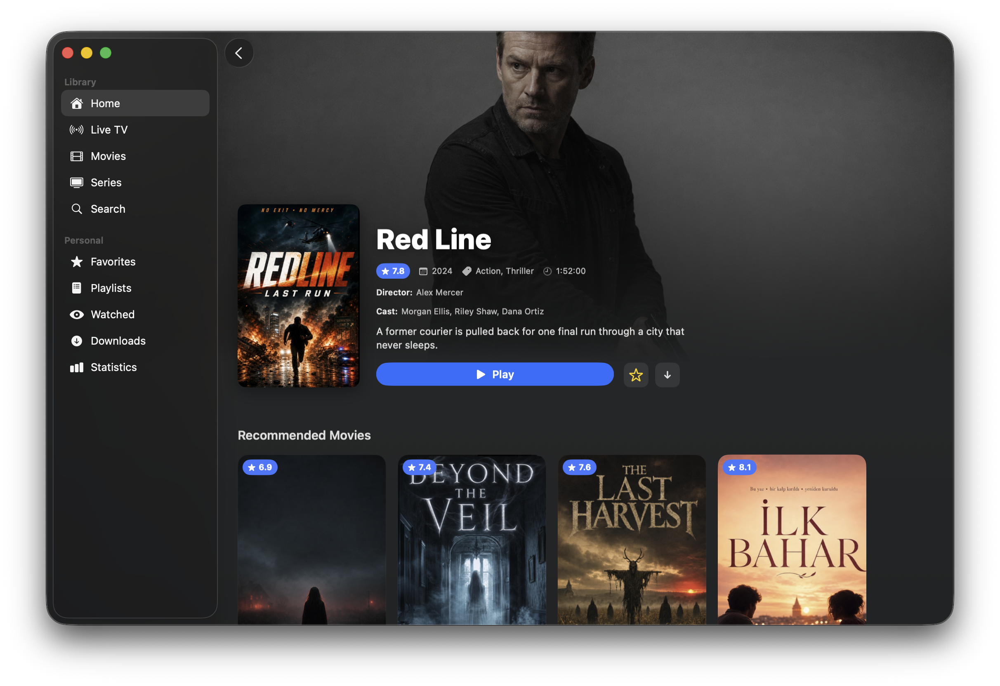
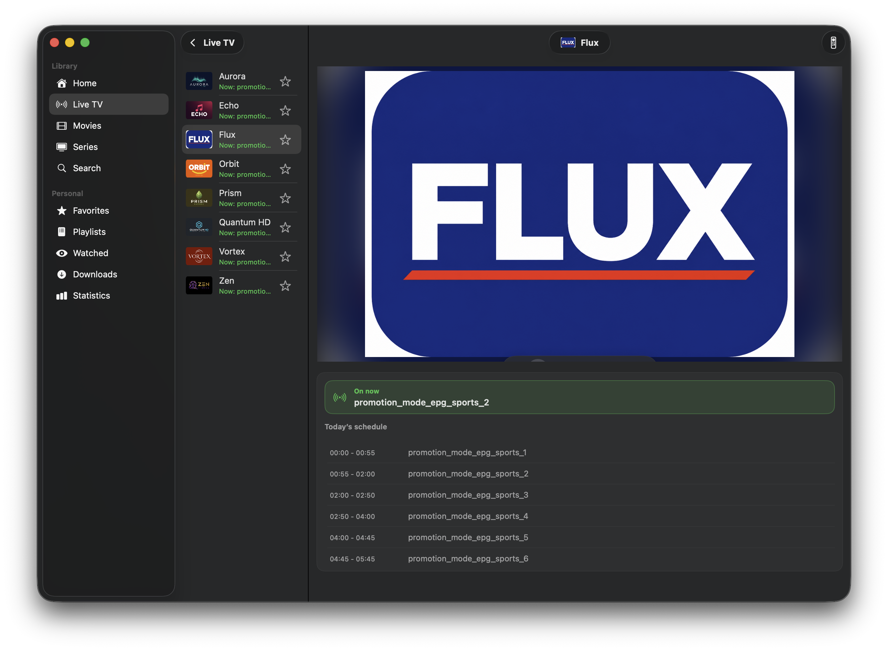
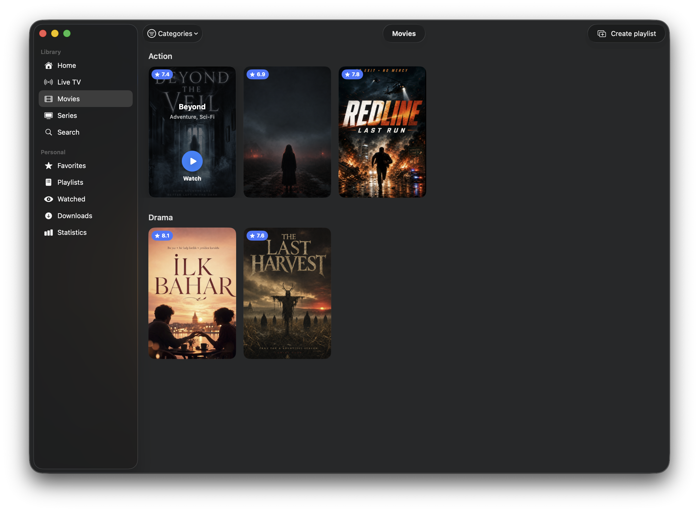
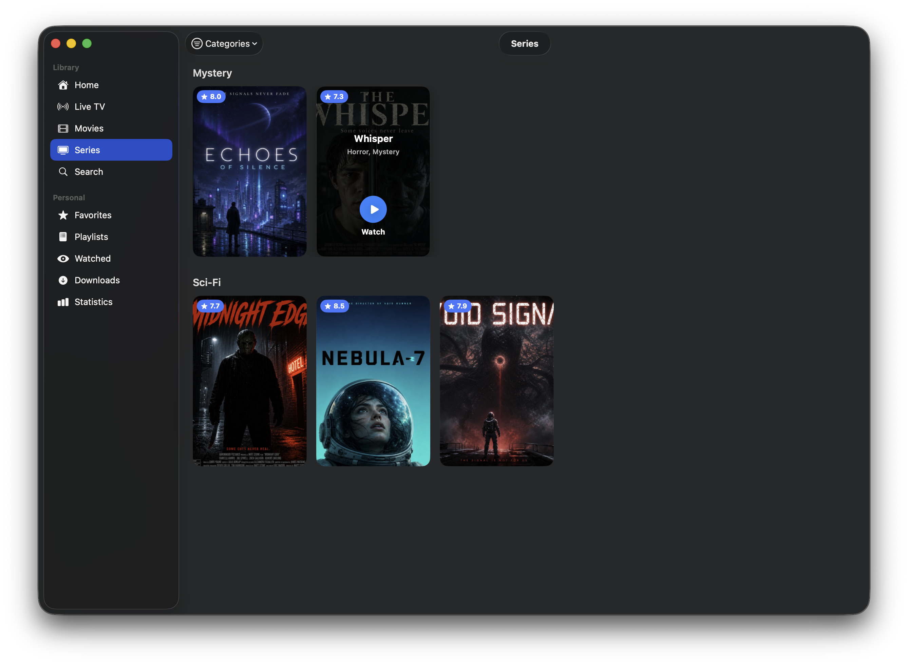
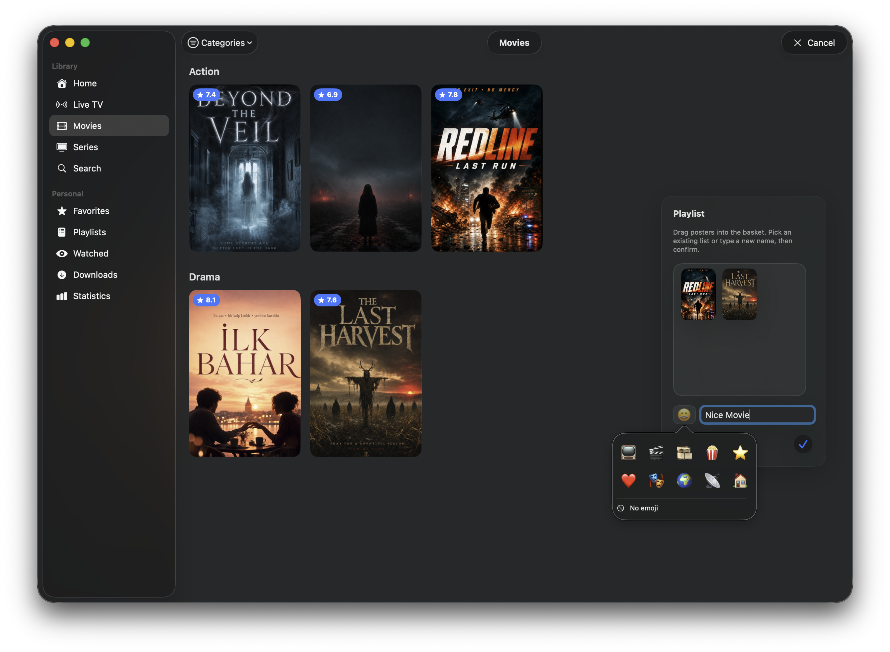
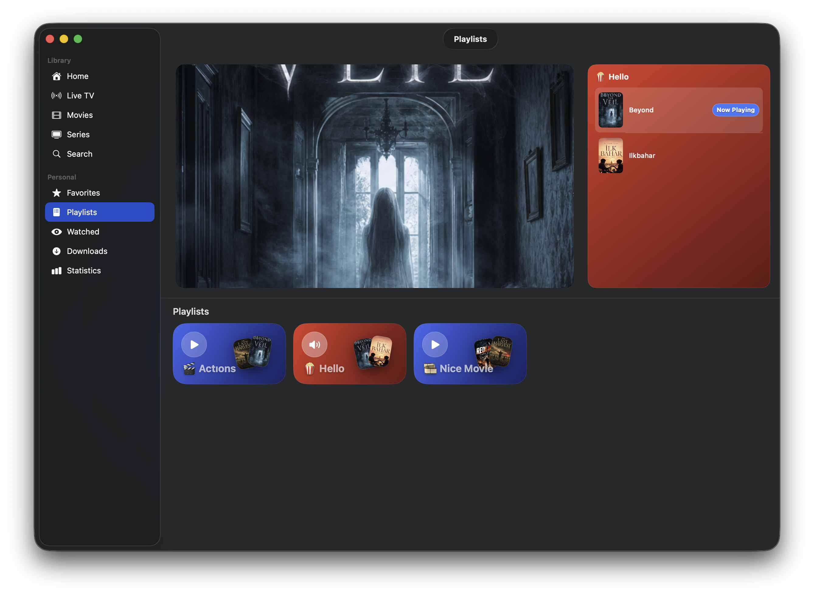
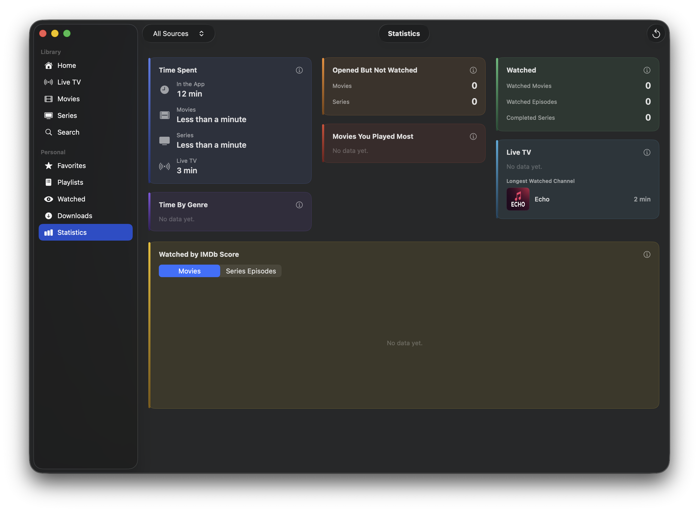
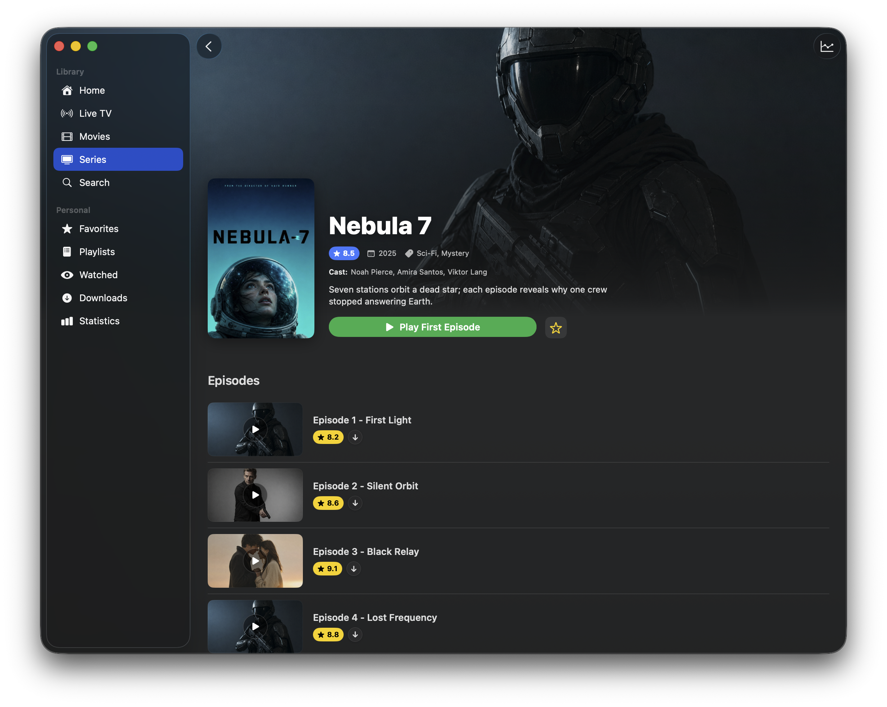
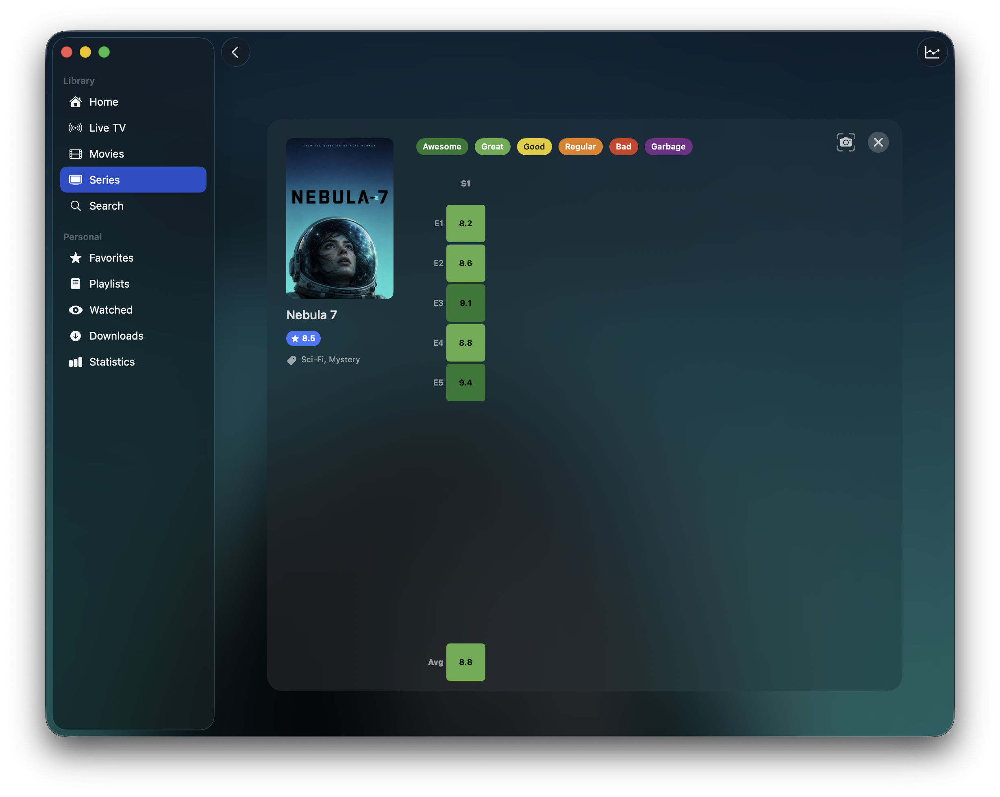

# tuplutv (beta)

**A simple, fast, and modern IPTV experience for macOS.**

---

## Screenshots
⚠️ The films shown in the images were created using AI and serve as examples.

⚠️The current images may differ from those in the latest version of the app (version 0.5.0)
<table>
 <table>
  <tr>
    <td width="50%">
      
       Home
    </td>
    <td width="50%">
      
       Movie detail with recommendations
    </td>
  </tr>
  <tr>
    <td width="50%">
      
       Movie detail
    </td>
    <td width="50%">
      
       Live TV
    </td>
  </tr>
  <tr>
    <td width="50%">
      
       Movies
    </td>
    <td width="50%">
      
       Series
    </td>
  </tr>
  <tr>
    <td width="50%">
      
       Create playlist
    </td>
    <td width="50%">
      
       Movie detail — Ilkbahar
    </td>
  </tr>
  <tr>
    <td width="50%">
      
       Playlists
    </td>
    <td width="50%">
      
       Statistics
    </td>
  </tr>
  <tr>
    <td width="50%">
      
       Series detail — episodes
    </td>
    <td width="50%">
      
       Series detail
    </td>
  </tr>
  <tr>
    <td colspan="2" align="center">
      
       Episode ratings
    </td>
  </tr>
</table>

---

- ⚠️ macOS 26 tahoe minimum system requirements
  
-Supported Languages: Turkish, English, Spanish

---

## My Future Plans and Dreams
-Get the app to a place everyone can love. That’s a very hard goal, but I built this app for everyone—matching what people want is my top priority.

-Ship on the App Store.
The main reason I’m not on the App Store yet is that I can’t afford the $99/year fee right now; money’s a bit tight. If I do publish there, the app will be fully free, with an optional in-app purchase—but not like a lot of other App Store apps: it would be entirely the user’s choice. People who don’t pay won’t face any restrictions or time limits.

-After an App Store release, bigger goals: a version that works end-to-end across the Apple ecosystem—Apple TV, Apple Watch, iPhone, and so on. For me that’s still a long way off—a big goal, or a dream

---
## Future

### Playlists & sources
- Add and manage multiple IPTV sources (M3U URL and Xtream API)
- Organize sources with custom display names and emoji icons
- Automatic catalog sync with configurable refresh intervals
- On-disk catalog cache for faster startup and offline browsing
- Support for multiple sources at once with per-source filtering

### Home & browsing
- Home screen with Movie of the Day, category shortcuts, and recently watched shelves
- Dedicated Movies and Series libraries grouped by genre/category
- TMDB-powered trending today shelves on the home page
- Full-text search across live channels, movies, and series
- Search scope filters and collapsible result sections
- Custom category management — hide, reorder, and create your own groups
- Cinematic media detail pages with backdrop art, cast, synopsis, and metadata
- TMDB enrichment for posters, descriptions, and extra artwork
- IMDb ratings on posters, detail screens, and statistics
- Movie recommendations on detail pages
- Series detail with season/episode lists, thumbnails, and per-episode ratings
- Episode ratings heatmap — visual IMDb score grid across all seasons
- Optional animated backdrop preview on detail pages

### Live TV
- Live channel browser with logos and now-playing info
- Electronic Program Guide (EPG) for Xtream-compatible sources
- Floating live TV remote panel with keyboard shortcuts
- Channel picker and quick channel switching
- Channel zapping visual effect (optional)
- Jump from home or search directly into a live channel

### Playback
- Built-in player with native and VLC engine options
- Smooth streaming playback for live TV, movies, and episodes
- Fullscreen mode with cinematic header and stream info
- Picture-in-Picture (PiP) support
- Resume watch progress for movies and series episodes
- Preferred subtitle and audio language selection
- Customizable subtitle appearance (size, color, background)
- Global volume control and audio output device selection
- In-player episode panel for series binge-watching
- Download and play offline from the detail screen or episode list

### Personal library
- Favorites for quick access to saved titles
- Custom movie playlists — drag posters to build lists and play them back
- Watched history tracking
- Download manager for movies and series episodes
- Offline mode — watch downloaded content without network access
- Download queue with progress, cancel, and Finder integration

### Statistics
- Usage dashboard with time spent in app, movies, series, and live TV
- Track opened-but-not-watched, completed movies, episodes, and series
- Most-played movies and longest-watched live channels
- Time-by-genre breakdown
- Watched-by-IMDb-score chart
- Filter stats by playlist source or view all sources combined

### Appearance & settings
- Clean, focused macOS interface built with SwiftUI
- Light, dark, and system theme support
- Dynamic detail page coloring from poster/backdrop art
- Sidebar or bottom dock navigation layout
- App language: English, Turkish, Spanish, and French
- Cache management and storage overview
- Built-in update checker

---
⚠️
The app does not provide any movie or TV content.
As the developer, I cannot and will not provide content sources.
You need to add your own Xtream or M3U sources.

---

## Important
-⚠️ Please send feedback to my email. It would help me most if you could include: your device details, screenshots from the app, and your feedback—but this isn’t a rule. Anyone can share thoughts however they like; it’s just easier for me to understand when it’s structured that way.

My email is in the app under Settings → About

---
## Legal Notes

**IMDb Non-Commercial Datasets**  
Ratings may be sourced from the IMDb `title.ratings` dataset at [datasets.imdbws.com](https://datasets.imdbws.com/).  
**Information courtesy of IMDb (https://www.imdb.com). Used with permission.**  
Dataset info: [developer.imdb.com/non-commercial-datasets](https://developer.imdb.com/non-commercial-datasets)  
Terms: [imdb.com/conditions](https://www.imdb.com/conditions) — personal and non-commercial use only.

### TMDB
The TMBD API is used to provide movie and TV show metadata
This product uses the TMDB API but is not endorsed or certified by TMDB.

### VLC / VLCKit

This app may use VLCKit/VLC components for video playback. VLC is a product of the VideoLAN project.

- VLC: [https://www.videolan.org/vlc/](https://www.videolan.org/vlc/)
- VideoLAN: [https://www.videolan.org/](https://www.videolan.org/)

Usage is subject to the license terms of the related libraries.
